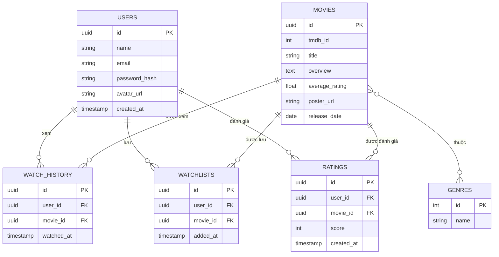

# Thiết Kế Database (Bổ sung) — Movie Recommendation App

File này bổ sung cho `KE_HOACH_DU_AN.md` và `CAU_TRUC_DU_AN.md`, mô tả chi tiết các bảng dữ liệu chính (PostgreSQL, có thể dùng với Prisma ORM).

## 1. Sơ đồ quan hệ (ERD tóm tắt)

## 2. Chi tiết từng bảng

### `users`
| Cột | Kiểu | Ghi chú |
|---|---|---|
| id | UUID (PK) | |
| name | VARCHAR | |
| email | VARCHAR, UNIQUE | |
| password_hash | VARCHAR | bcrypt hash |
| avatar_url | VARCHAR, nullable | |
| created_at | TIMESTAMP | |

### `movies` (cache từ TMDB)
| Cột | Kiểu | Ghi chú |
|---|---|---|
| id | UUID (PK) | |
| tmdb_id | INT, UNIQUE | ID gốc từ TMDB |
| title | VARCHAR | |
| overview | TEXT | Mô tả phim, dùng cho content-based similarity |
| average_rating | FLOAT | Rating trung bình (TMDB hoặc nội bộ) |
| poster_url | VARCHAR | |
| release_date | DATE | |

### `genres` & bảng nối `movie_genres`
| Cột | Kiểu |
|---|---|
| id | INT (PK) |
| name | VARCHAR |

`movie_genres(movie_id FK, genre_id FK)` — quan hệ nhiều-nhiều giữa phim và thể loại.

### `watch_history`
| Cột | Kiểu | Ghi chú |
|---|---|---|
| id | UUID (PK) | |
| user_id | UUID (FK → users) | |
| movie_id | UUID (FK → movies) | |
| watched_at | TIMESTAMP | Dùng cho RecencyBoost |

### `watchlists`
| Cột | Kiểu | Ghi chú |
|---|---|---|
| id | UUID (PK) | |
| user_id | UUID (FK → users) | |
| movie_id | UUID (FK → movies) | |
| added_at | TIMESTAMP | |

Ràng buộc: `UNIQUE(user_id, movie_id)` để tránh thêm trùng.

### `ratings` (nếu cho phép người dùng tự chấm điểm phim)
| Cột | Kiểu | Ghi chú |
|---|---|---|
| id | UUID (PK) | |
| user_id | UUID (FK → users) | |
| movie_id | UUID (FK → movies) | |
| score | INT (1–10) | |
| created_at | TIMESTAMP | |

## 3. Ghi chú cho Recommendation Engine
- **GenreMatchScore**: truy vấn `watch_history` + `movie_genres` để lấy top thể loại người dùng hay xem (đếm tần suất)
- **SimilarityScore**: dùng `overview` + `movie_genres` của các phim trong `watch_history` để so sánh (cosine similarity trên vector TF-IDF hoặc one-hot thể loại) với phim ứng viên
- **AverageRatingScore**: lấy `movies.average_rating`, chuẩn hóa về thang 0–1
- **RecencyBoost**: dựa trên `watch_history.watched_at`, ưu tiên các phim xem trong khoảng thời gian gần (vd: 14 ngày gần nhất) khi tính similarity

## 4. Index đề xuất
- `watch_history(user_id, watched_at DESC)` — truy vấn lịch sử nhanh, hỗ trợ RecencyBoost
- `watchlists(user_id)`
- `ratings(user_id, movie_id)`
- `movies(tmdb_id)` — tránh cache trùng khi đồng bộ từ TMDB
