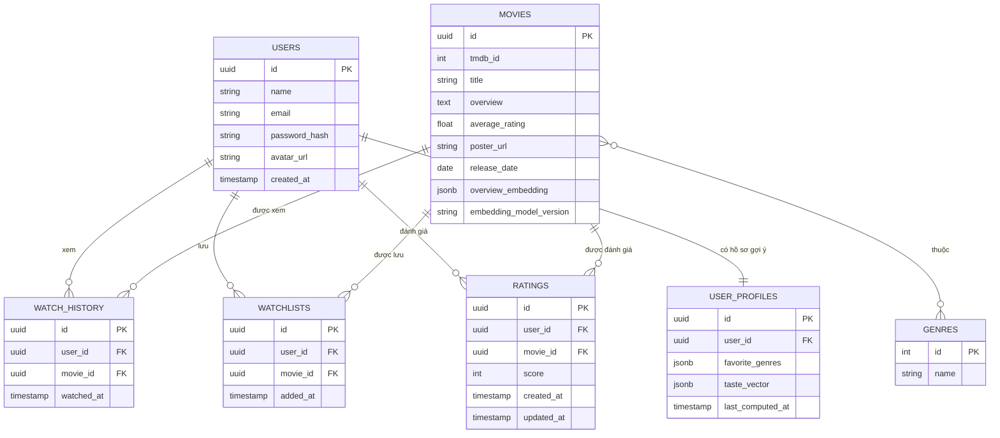

# Thiết Kế Database (Bổ sung) — Movie Recommendation App

File này bổ sung cho `KE_HOACH_DU_AN.md` và `CAU_TRUC_DU_AN.md`, mô tả chi tiết các bảng dữ liệu chính (PostgreSQL, có thể dùng với Prisma ORM).

## 1. Sơ đồ quan hệ (ERD tóm tắt)

## 2. Chi tiết từng bảng

### `users`
| Cột | Kiểu | Ghi chú |
|---|---|---|
| id | UUID (PK) | |
| name | VARCHAR | |
| email | VARCHAR, UNIQUE | |
| password_hash | VARCHAR | bcrypt hash |
| avatar_url | VARCHAR, nullable | |
| created_at | TIMESTAMP | |

### `movies` (cache từ TMDB)
| Cột | Kiểu | Ghi chú |
|---|---|---|
| id | UUID (PK) | |
| tmdb_id | INT, UNIQUE | ID gốc từ TMDB |
| title | VARCHAR | |
| overview | TEXT | Mô tả phim, dùng làm input để sinh `overview_embedding` |
| average_rating | FLOAT | Rating trung bình (TMDB hoặc nội bộ) |
| poster_url | VARCHAR | |
| release_date | DATE | |
| overview_embedding | JSONB, nullable | Vector đặc trưng (sentence embedding) sinh từ `overview` bởi `recommendation-service` (model `sentence-transformers`), dùng để tính `SimilarityScore`. `NULL` cho tới khi job `embed-movie` chạy xong — `SimilarityScorer` phải xử lý trường hợp này bằng giá trị fallback trung lập, không được coi là 0 |
| embedding_model_version | VARCHAR, nullable | Tên/phiên bản model đã sinh `overview_embedding` (vd `paraphrase-multilingual-MiniLM-L12-v2-v1`). Bắt buộc phải lưu để tránh so sánh cosine similarity giữa 2 vector sinh từ 2 model khác nhau (không cùng không gian, kết quả vô nghĩa); khi đổi model phải recompute lại toàn bộ phim có version cũ |

### `genres` & bảng nối `movie_genres`
| Cột | Kiểu |
|---|---|
| id | INT (PK) |
| name | VARCHAR |

`movie_genres(movie_id FK, genre_id FK)` — quan hệ nhiều-nhiều giữa phim và thể loại.

### `watch_history`
| Cột | Kiểu | Ghi chú |
|---|---|---|
| id | UUID (PK) | |
| user_id | UUID (FK → users) | |
| movie_id | UUID (FK → movies) | |
| watched_at | TIMESTAMP | Dùng cho RecencyBoost, và cho trọng số thời gian khi tính `taste_vector` |

### `watchlists`
| Cột | Kiểu | Ghi chú |
|---|---|---|
| id | UUID (PK) | |
| user_id | UUID (FK → users) | |
| movie_id | UUID (FK → movies) | |
| added_at | TIMESTAMP | |

Ràng buộc: `UNIQUE(user_id, movie_id)` để tránh thêm trùng.

### `ratings` (nếu cho phép người dùng tự chấm điểm phim)
| Cột | Kiểu | Ghi chú |
|---|---|---|
| id | UUID (PK) | |
| user_id | UUID (FK → users) | |
| movie_id | UUID (FK → movies) | |
| score | INT (1–10) | |
| created_at | TIMESTAMP | |
| updated_at | TIMESTAMP | Cập nhật khi user sửa lại rating đã có (upsert) |

Ràng buộc: `UNIQUE(user_id, movie_id)` — mỗi user chỉ có 1 rating cho 1 phim, rate lại thì `UPDATE` chứ không tạo dòng mới. Đây cũng là bảng **kích hoạt sự kiện** `recalculate-user-profile` (cùng với `watch_history`, `watchlists`) mỗi khi có `INSERT`/`UPDATE`.

### `user_profiles` *(bảng mới — phục vụ Hybrid: Cache + Invalidate)*
| Cột | Kiểu | Ghi chú |
|---|---|---|
| id | UUID (PK) | |
| user_id | UUID (FK → users), UNIQUE | Quan hệ 1-1 với user |
| favorite_genres | JSONB | Danh sách thể loại yêu thích kèm trọng số, vd: `[{"genre_id": 28, "weight": 0.42}, ...]` — dùng để tính `GenreMatchScore` |
| taste_vector | JSONB | Trung bình có trọng số (ưu tiên phim xem gần đây, half-life ~14 ngày) của `movies.overview_embedding` các phim user đã xem — dùng để tính `SimilarityScore` bằng cosine similarity. Bỏ qua các phim chưa có `overview_embedding` (job `embed-movie` chưa chạy xong) khi tính trung bình |
| last_computed_at | TIMESTAMP | Thời điểm worker tính lại gần nhất |

Bảng này là nơi **BullMQ worker** (`userProfile.worker.ts`) ghi kết quả sau khi xử lý job `recalculate-user-profile`, thay vì phải quét lại toàn bộ `watch_history`/`ratings` mỗi lần tính recommendation. Khi API `/recommendations` cần `GenreMatchScore`/`SimilarityScore`, nó đọc trực tiếp từ `user_profiles` (nhanh) thay vì tính lại từ đầu.

## 3. Ghi chú cho Recommendation Engine
- **GenreMatchScore**: đọc `user_profiles.favorite_genres` (đã được worker tính sẵn từ `watch_history` + `movie_genres`) — không truy vấn lại từ đầu mỗi lần gọi API
- **SimilarityScore**: đọc `user_profiles.taste_vector`, tính cosine similarity với `movies.overview_embedding` của từng phim ứng viên. Cả hai vector phải cùng `embedding_model_version` — phép toán này chạy thuần trong Node (`recommendation/scoring/similarity.ts`), không gọi lại `recommendation-service`. Nếu phim ứng viên chưa có `overview_embedding` (mới cache, job `embed-movie` chưa xong), trả về giá trị trung lập thay vì 0 để không đánh giá thấp bất công phim mới
- **AverageRatingScore**: lấy `movies.average_rating`, chuẩn hóa về thang 0–1 — cột này được **cron job batch** cập nhật định kỳ (mỗi 1–6 giờ), không phụ thuộc user
- **RecencyBoost**: dựa trên `watch_history.watched_at`, tính trực tiếp tại thời điểm gọi API, ưu tiên các phim xem trong khoảng thời gian gần (vd: 14 ngày gần nhất)

### Luồng cập nhật `user_profiles`
1. User rate/xem/thêm watchlist → `history`/`watchlist`/`rating` service ghi vào bảng tương ứng → enqueue job `recalculate-user-profile`
2. `userProfile.worker.ts` đọc lại `watch_history` + `ratings` + `movie_genres` + `movies.overview_embedding` **chỉ của user đó** → tính `favorite_genres` và `taste_vector` mới (trung bình có trọng số theo thời gian)
3. Worker `UPDATE user_profiles SET favorite_genres = ..., taste_vector = ..., last_computed_at = now() WHERE user_id = ...`
4. Worker xóa cache Redis `recommend:{user_id}` để lần gọi API tiếp theo lấy dữ liệu mới

### Luồng cập nhật `movies.overview_embedding` *(mới)*
1. `movie.service.ts` cache 1 phim **mới** từ TMDB (`INSERT` vào `movies`) → enqueue job `embed-movie` (không đồng bộ, không chặn response)
2. `movieEmbedding.worker.ts` gọi `recommendation-service` (`POST /internal/movies/{id}/embed`) với nội dung `overview`
3. `recommendation-service` (`MovieEmbedder`, model `sentence-transformers`) trả về vector
4. Worker `UPDATE movies SET overview_embedding = ..., embedding_model_version = ... WHERE id = ...`
5. Nếu sau này đổi `embedding_model_version` (nâng cấp model), cần 1 lượt batch recompute lại toàn bộ phim có version cũ trước khi dùng version mới để so sánh

## 4. Index đề xuất
- `watch_history(user_id, watched_at DESC)` — truy vấn lịch sử nhanh, hỗ trợ RecencyBoost
- `watchlists(user_id)`
- `ratings(user_id, movie_id)` UNIQUE — vừa đảm bảo ràng buộc, vừa tăng tốc upsert
- `user_profiles(user_id)` UNIQUE — tra cứu nhanh khi tính recommendation
- `movies(tmdb_id)` — tránh cache trùng khi đồng bộ từ TMDB
- `movies(embedding_model_version)` — hỗ trợ truy vấn "phim nào còn version cũ" khi cần batch recompute

**Ghi chú về quy mô**: ở quy mô hiện tại (catalog vài nghìn phim), lưu `overview_embedding` dạng JSONB và tính cosine similarity trong application code (Node) là đủ nhanh, không cần extension `pgvector` hay ANN index. Chỉ cân nhắc `pgvector` + HNSW index nếu catalog phim tăng lên hàng trăm nghìn trở lên — không triển khai trước khi thực sự cần (tránh over-engineering).
