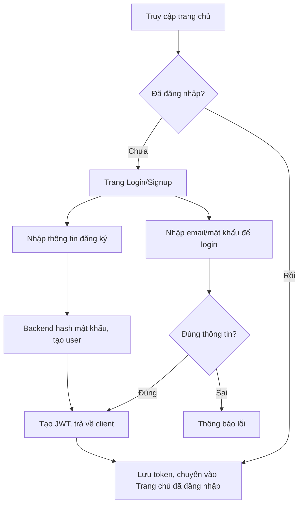
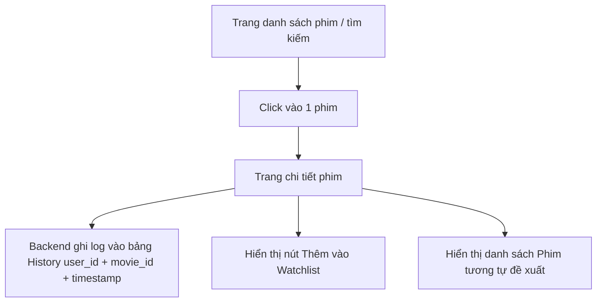
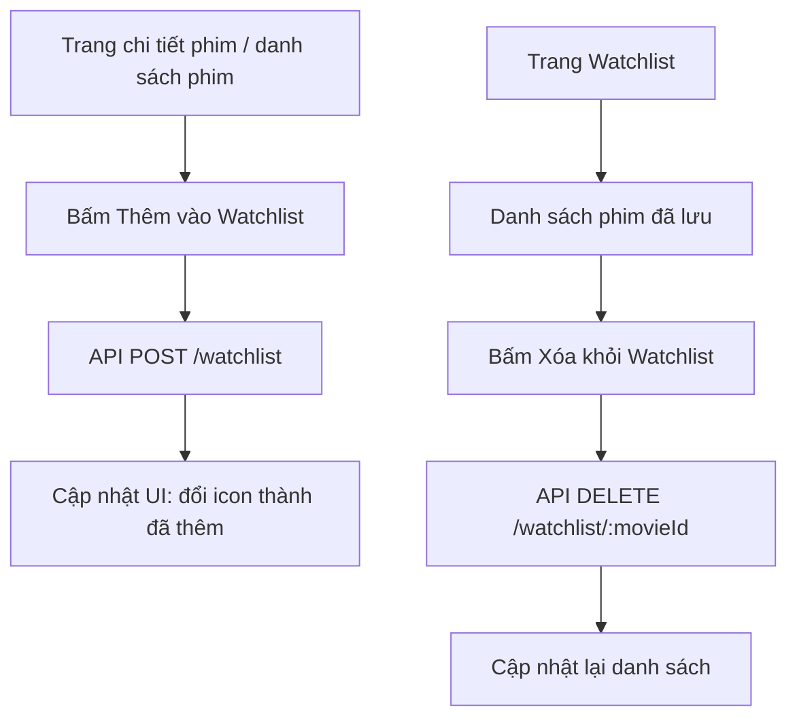
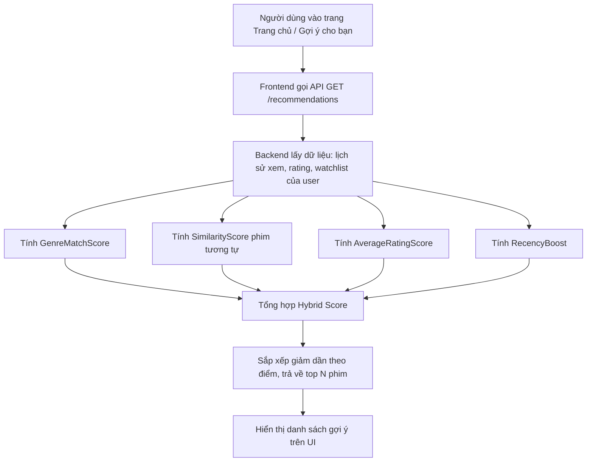
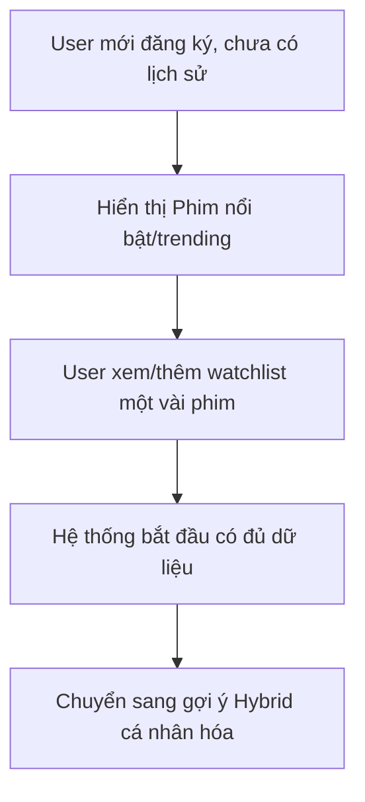

# Luồng Người Dùng (User Flow) — Movie Recommendation App

## 1. Luồng đăng ký / đăng nhập

**Chi tiết bước:**
1. Người dùng mới bấm "Đăng ký" → nhập tên, email, mật khẩu
2. Backend hash mật khẩu (bcrypt), lưu vào DB
3. Hệ thống sinh JWT (hoặc session) → lưu ở client (httpOnly cookie hoặc localStorage)
4. Người dùng cũ bấm "Đăng nhập" → xác thực email/mật khẩu → nhận JWT
5. (Tùy chọn) "Quên mật khẩu" → gửi email chứa link reset kèm token có hạn (ví dụ 15 phút)
6. Sau đăng nhập, người dùng có thể vào trang **Profile** để cập nhật tên/avatar

## 2. Luồng xem phim & lưu lịch sử

**Chi tiết bước:**
1. Người dùng duyệt danh sách phim (trang chủ, tìm kiếm, theo thể loại)
2. Click vào 1 phim → điều hướng đến trang chi tiết
3. Ngay khi trang chi tiết load, gọi API `POST /history` để lưu (nếu đã đăng nhập)
4. Trang chi tiết hiển thị: thông tin phim, rating, nút "Thêm vào Watchlist", danh sách phim tương tự
5. Người dùng có thể vào trang **Lịch sử xem** để xem lại, xóa từng mục hoặc "Xóa tất cả"

## 3. Luồng Watchlist

**Chi tiết bước:**
1. Từ bất kỳ đâu hiển thị phim (danh sách, chi tiết, gợi ý) đều có nút thêm/xóa watchlist
2. Trang "Watchlist của tôi" hiển thị toàn bộ phim đã lưu, sắp xếp theo thời gian thêm mới nhất
3. Có thể xóa từng phim trực tiếp từ trang này

## 4. Luồng nhận gợi ý phim (Recommendation)

**Chi tiết bước:**
1. Khi người dùng đăng nhập và vào trang chủ / mục "Gợi ý cho bạn"
2. Frontend gọi API `/recommendations`, backend tổng hợp dữ liệu hành vi user
3. Hệ thống tính điểm hybrid cho từng phim ứng viên (loại trừ phim đã xem)
4. Trả về danh sách top N phim, kèm nhãn lý do gợi ý (vd: "Vì bạn thích thể loại Hành động", "Tương tự phim bạn vừa xem")
5. Nếu user mới chưa có lịch sử → fallback về "Phim nổi bật" (trending/top rated) để tránh cold-start

## 5. Luồng người dùng mới (cold-start)

## 6. Tổng quan các trang chính (screens)
| Trang | Yêu cầu đăng nhập | Mô tả |
|---|---|---|
| Trang chủ | Không bắt buộc | Phim nổi bật + gợi ý cá nhân hóa (nếu đã login) |
| Đăng ký/Đăng nhập | Không | Form auth |
| Chi tiết phim | Không bắt buộc | Thông tin phim, nút watchlist, phim tương tự |
| Lịch sử xem | Có | Danh sách phim đã xem, xóa từng mục/toàn bộ |
| Watchlist | Có | Danh sách phim muốn xem sau |
| Gợi ý cho bạn | Có (fallback cho khách) | Danh sách hybrid recommendation |
| Profile | Có | Xem/cập nhật tên, email, avatar |
