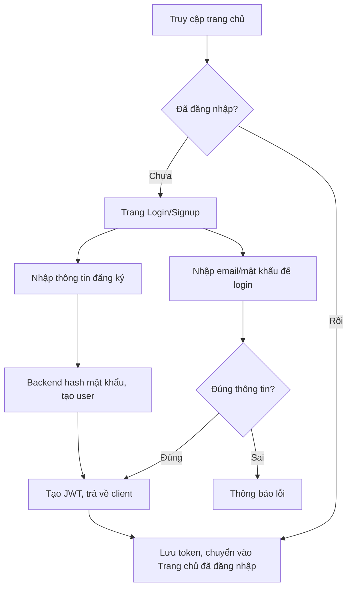
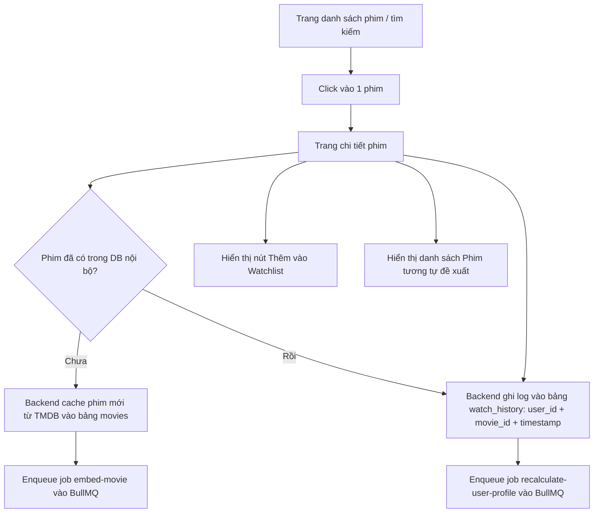
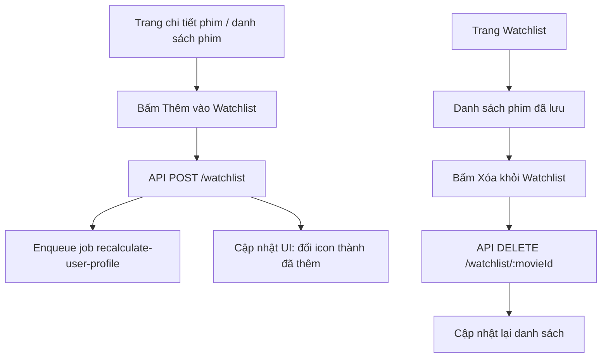
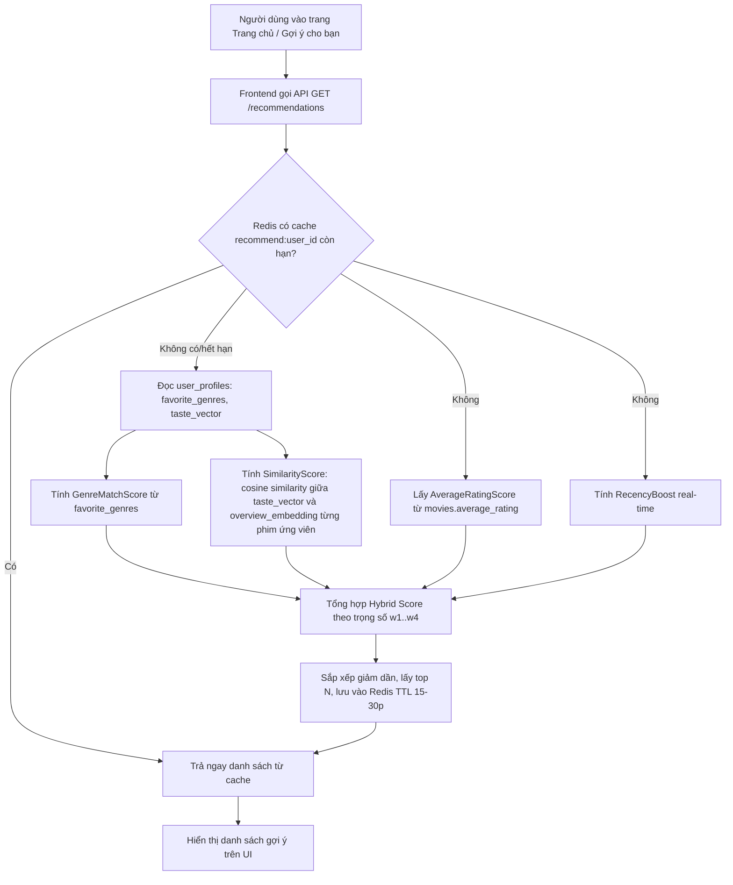
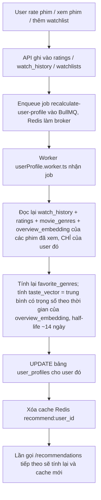
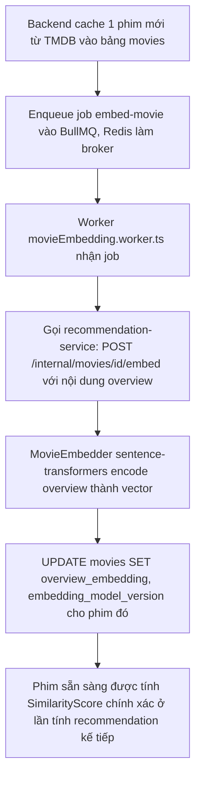
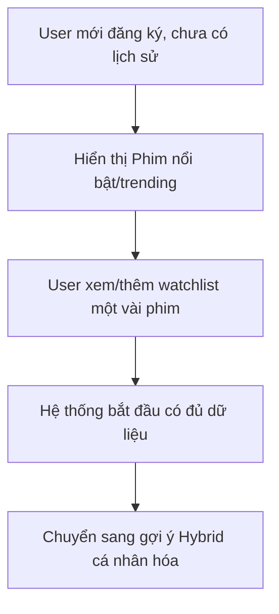

# Luồng Người Dùng (User Flow) — Movie Recommendation App

## 1. Luồng đăng ký / đăng nhập

**Chi tiết bước:**
1. Người dùng mới bấm "Đăng ký" → nhập tên, email, mật khẩu
2. Backend hash mật khẩu (bcrypt), lưu vào DB
3. Hệ thống sinh JWT (hoặc session) → lưu ở client (httpOnly cookie hoặc localStorage)
4. Người dùng cũ bấm "Đăng nhập" → xác thực email/mật khẩu → nhận JWT
5. (Tùy chọn) "Quên mật khẩu" → gửi email chứa link reset kèm token có hạn (ví dụ 15 phút)
6. Sau đăng nhập, người dùng có thể vào trang **Profile** để cập nhật tên/avatar

## 2. Luồng xem phim & lưu lịch sử

**Chi tiết bước:**
1. Người dùng duyệt danh sách phim (trang chủ, tìm kiếm, theo thể loại)
2. Click vào 1 phim → điều hướng đến trang chi tiết
3. Nếu phim chưa từng được cache, backend lấy dữ liệu từ TMDB, lưu vào bảng `movies`, sau đó **enqueue job
   `embed-movie`** (xem mục 4c) để sinh `overview_embedding` — không chặn response trả trang chi tiết phim
   cho người dùng, việc sinh embedding chạy nền
4. Ngay khi trang chi tiết load, gọi API `POST /history` để lưu (nếu đã đăng nhập)
5. Sau khi ghi `watch_history` thành công, backend **enqueue job `recalculate-user-profile`** (xem mục 4b) để cập nhật gợi ý dựa trên hành vi vừa rồi
6. Trang chi tiết hiển thị: thông tin phim, rating, nút "Thêm vào Watchlist", danh sách phim tương tự
7. Người dùng có thể vào trang **Lịch sử xem** để xem lại, xóa từng mục hoặc "Xóa tất cả"

## 3. Luồng Watchlist

**Chi tiết bước:**
1. Từ bất kỳ đâu hiển thị phim (danh sách, chi tiết, gợi ý) đều có nút thêm/xóa watchlist
2. Trang "Watchlist của tôi" hiển thị toàn bộ phim đã lưu, sắp xếp theo thời gian thêm mới nhất
3. Có thể xóa từng phim trực tiếp từ trang này
4. Mỗi lần thêm phim vào watchlist, backend cũng **enqueue job `recalculate-user-profile`** (tương tự luồng xem phim) — xóa watchlist thì không cần vì không phản ánh sở thích mới

## 4. Luồng nhận gợi ý phim (Recommendation) — đọc cache trước

**Chi tiết bước:**
1. Khi người dùng đăng nhập và vào trang chủ / mục "Gợi ý cho bạn"
2. Frontend gọi API `/recommendations`, backend **kiểm tra Redis cache** (`recommend:{user_id}`) trước tiên
3. Nếu còn cache hợp lệ → trả về ngay, không tính toán lại (nhanh)
4. Nếu không có cache (lần đầu, hoặc vừa bị xóa do user vừa rate/xem/watchlist) → tính lại:
   - `GenreMatchScore`: đọc trực tiếp từ `user_profiles.favorite_genres` (đã được worker tính sẵn ở luồng 4b, không quét lại toàn bộ lịch sử)
   - `SimilarityScore`: đọc `user_profiles.taste_vector`, tính cosine similarity (thuần Node, không gọi Python) với `movies.overview_embedding` của từng phim ứng viên. Phim chưa có `overview_embedding` (job `embed-movie` chưa xong) nhận điểm trung lập thay vì bị loại/điểm 0
   - `AverageRatingScore`: lấy từ `movies.average_rating` (đã được cron batch cập nhật định kỳ)
   - `RecencyBoost`: tính real-time tại thời điểm gọi
5. Tổng hợp theo công thức Hybrid Score, sắp xếp, lấy top N, **lưu kết quả vào Redis** (TTL ~15–30 phút) rồi trả về
6. Trả về danh sách kèm nhãn lý do gợi ý (vd: "Vì bạn thích thể loại Hành động", "Tương tự phim bạn vừa xem")
7. Nếu user mới chưa có lịch sử → fallback về "Phim nổi bật" (trending/top rated) để tránh cold-start

## 4b. Luồng cập nhật nền cho USER (Event-driven — khi user rate/xem/thêm watchlist)

**Chi tiết bước:**
1. User thực hiện 1 trong 3 hành động: đánh giá phim, xem phim mới, hoặc thêm vào watchlist
2. Backend ghi dữ liệu vào bảng tương ứng, sau đó **enqueue 1 job** vào hàng đợi BullMQ (không chặn response trả về cho user — xử lý bất đồng bộ)
3. Worker chạy nền, chỉ tính lại dữ liệu của **đúng user vừa thao tác** (không ảnh hưởng user khác, không quét toàn hệ thống). `taste_vector` được tính bằng trung bình có trọng số của các `overview_embedding` đã sinh sẵn — phim nào chưa có embedding thì bị bỏ qua ở lần tính này, sẽ được tính bù khi `embed-movie` xong và user có hành động tiếp theo
4. Kết quả được ghi vào `user_profiles` (persisted) và cache Redis cũ bị xóa
5. Người dùng gần như ngay lập tức thấy gợi ý "phản hồi" theo hành động vừa làm ở lần tải trang gợi ý tiếp theo, mà hệ thống vẫn không phải tính toán nặng mỗi lần có request

## 4c. Luồng sinh embedding cho PHIM mới (Event-driven — khi cache phim từ TMDB)

**Chi tiết bước:**
1. Mỗi khi có phim **mới** (chưa từng tồn tại trong DB nội bộ) được cache từ TMDB, backend enqueue 1 job `embed-movie` — không đồng bộ, không chặn việc trả trang chi tiết phim cho người dùng
2. `movieEmbedding.worker.ts` gọi sang `recommendation-service` để sinh vector đặc trưng từ `overview`
3. Kết quả ghi lại vào `movies.overview_embedding` cùng `embedding_model_version`
4. Cho tới khi job này chạy xong, phim đó vẫn xuất hiện được trong danh sách/gợi ý nhưng `SimilarityScore` của nó nhận giá trị trung lập (xem mục 4) thay vì bị loại — trải nghiệm người dùng không bị gián đoạn trong lúc chờ

## 5. Luồng người dùng mới (cold-start)

## 6. Tổng quan các trang chính (screens)
| Trang | Yêu cầu đăng nhập | Mô tả |
|---|---|---|
| Trang chủ | Không bắt buộc | Phim nổi bật + gợi ý cá nhân hóa (nếu đã login) |
| Đăng ký/Đăng nhập | Không | Form auth |
| Chi tiết phim | Không bắt buộc | Thông tin phim, nút watchlist, phim tương tự |
| Lịch sử xem | Có | Danh sách phim đã xem, xóa từng mục/toàn bộ |
| Watchlist | Có | Danh sách phim muốn xem sau |
| Gợi ý cho bạn | Có (fallback cho khách) | Danh sách hybrid recommendation |
| Profile | Có | Xem/cập nhật tên, email, avatar |
